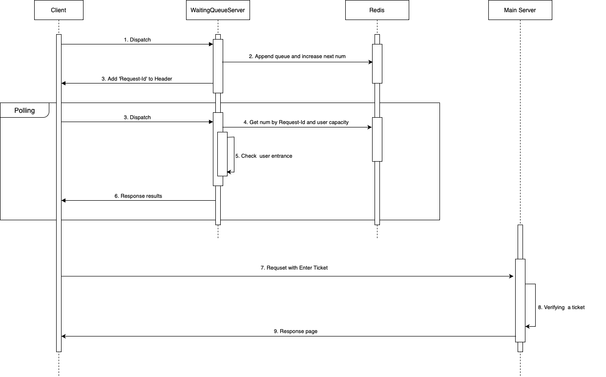

## 소개

별도의 프로젝트 개발 중 사용자 수가 급격히 몰릴 경우 서버가 다운되는 경우를 방지하기 위해 만든 프로젝트입니다. Redis와 Kafka를 통해 메인 서버와 통신하고 있으며 Go로 작성된 서비스입니다. 

## 서비스 요구 사항

* 메인 서버와 별도의 네트워크 환경에서 작동돼야 한다.
* 먼저 접속한 사용자를 먼저 입장시켜야 한다. (FIFO)
* 대기 중인 사용자의 순서와 나의 대기순서를 표시해야한다.
* 접속자 수가 많지 않을 때는 작동하지 않아야 한다.

## 서비스 구성
대기줄 서버의 Scale out을 대비해 Redis를 통해 대기줄 정보를 관리하고 있습니다.
또한, 메인 서버와의 실시간 통신을 위해 Kafka를 사용하고 있습니다.
### -Redis
**상태 관리 전략**
	CASE 1. 모든 대기자를 기록
		장점: 대기자 수를 정확히 추산 가능
		단점: 상태가 크고 동기화가 어렵다
	CASE 2. 가장 오래된 대기자만 기록
		장점: 발급된 순번과 진입 가능한 순번만 저장하기 때문에 상태 크기가 작고 동기화가 쉽다.
		단점: 대기자 수에 허수가 끼어있다.

**토픽 목록**
* {Request-Id: 대기 번호} - {String: Integer}
* 다음 대기 번호 - Integer
* 입장 가능한 번호 - Integer
### -Kafka
Kafka를 통해 메인 서버에 추가로 입장할 수 있는 사용자 수를 받고 있다. Goroutintes를 통해 멀티쓰레드로 작동하기 때문에 대기줄 프로세스와는 별도로 작동한다.

## 비즈니스 로직 다이어그램



```markdown
1. 클라이언트가 로드밸런서에 의해 대기 서버로 요청됨.
2. 임의의 UUID를 생성 후 Redis에서 다음 대기 번호를 조회, UUID를 키값으로 대기번호를 저장함.
3. 응답 헤더 Request-Id에 생성된 UUID를 추가하여 응답.
4. 응답받은 헤더를 유지하며 1초마다 Polling 요청을 보냄.
5. 요청받은 Request-Id를 통해 Redis에 저장된 대기 번호를 확인하고 입장 가능 여부를 판별
6. 입장이 가능할 경우 암호화된 입장 티켓을 응답.
    입장이 불가능할 경우 현제 대기 번호와 내 뒤 대기자 수를 응답.
7. 응답 결과가 성공일 경우 메인 서버에 입장 티켓과 함께 요청
    실패일 경우 1초 뒤 다시 풀링 요청.
8. 입장 티켓 검증 후 페이지 응답.
```

